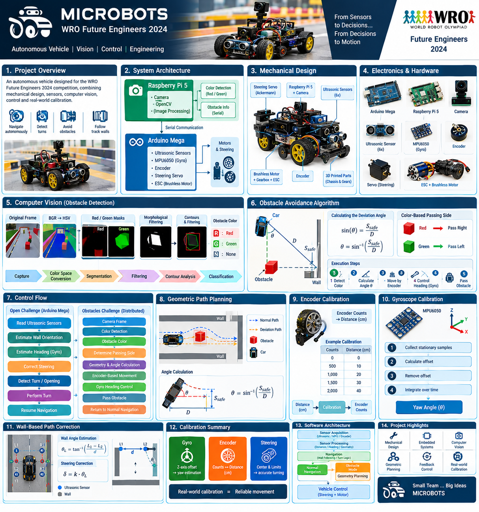
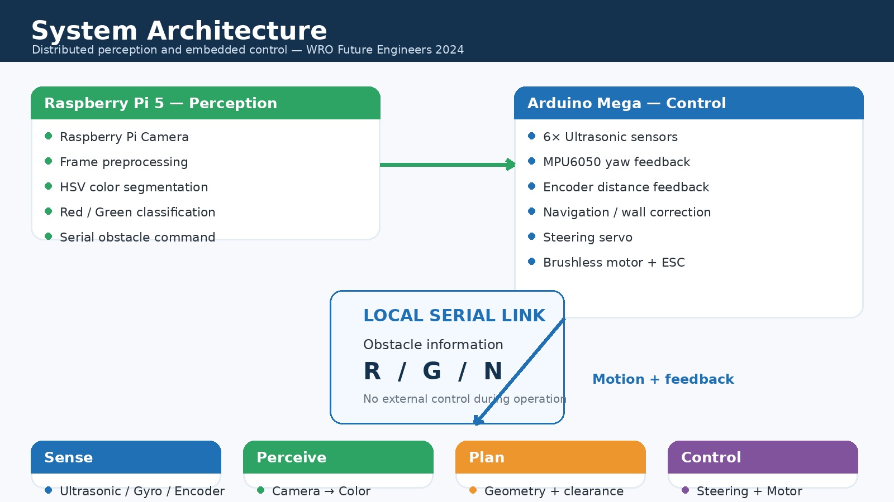
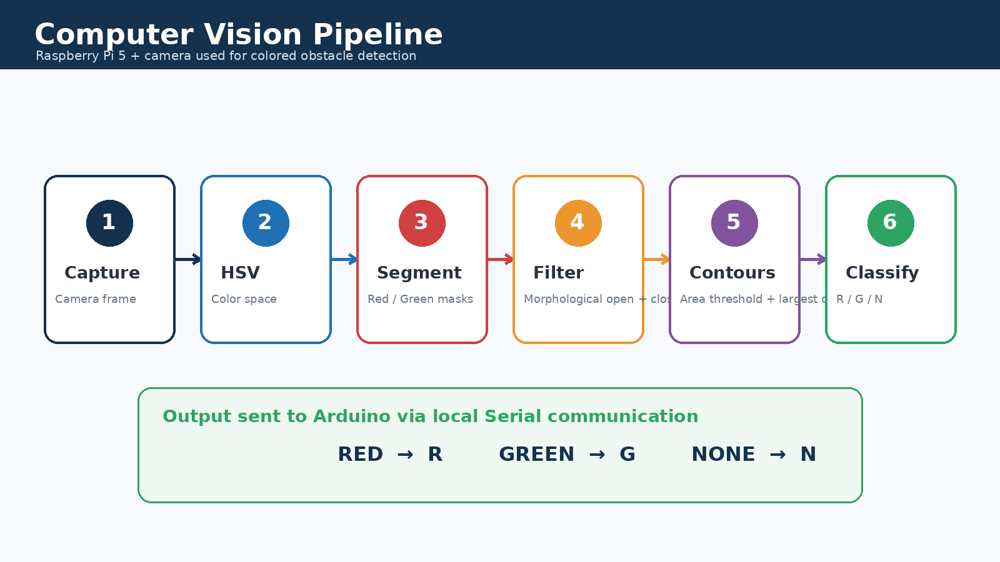
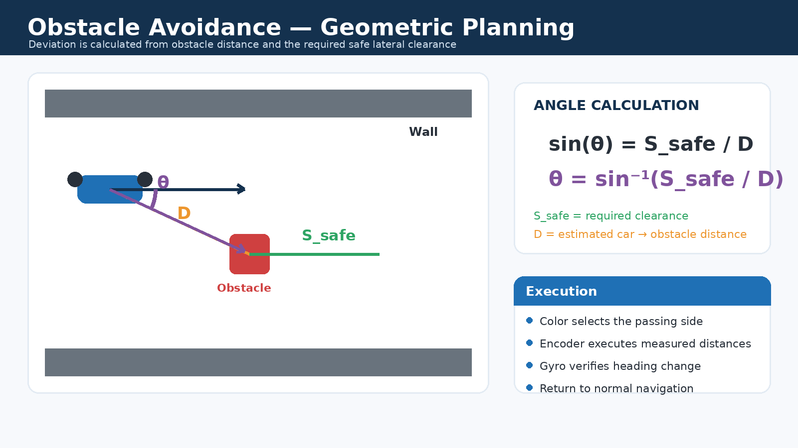
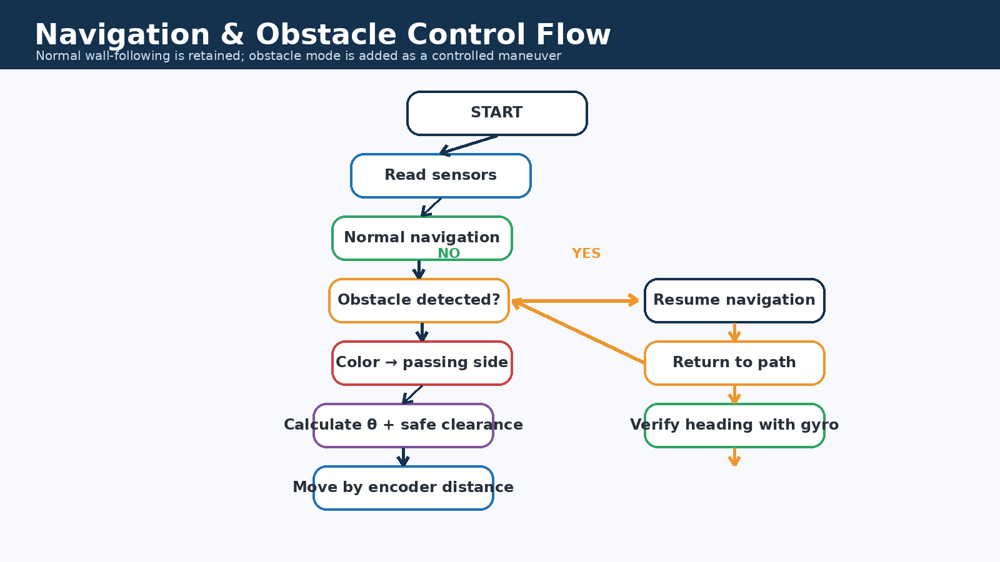
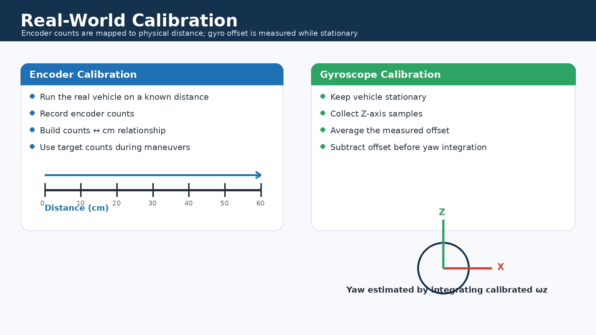

# 🤖 Microbots — WRO Future Engineers 2024

<p align="center">
  
</p>

<p align="center">
  <b>Autonomous Vehicle Engineering Project</b><br>
  Mechanical Design · Embedded Systems · Computer Vision · Geometric Planning · Feedback Control
</p>

---

## 🏁 Project at a Glance

Microbots developed an autonomous vehicle for **WRO Future Engineers 2024** using a realistic **Ackermann steering system**.

The platform evolved through two competition configurations:

| Challenge | Main Compute | Perception | Control |
|---|---|---|---|
| **Open Challenge** | Arduino Mega | Ultrasonic + MPU6050 | Steering + ESC |
| **Obstacles Challenge** | Arduino Mega + Raspberry Pi 5 | Camera + OpenCV + Ultrasonic | Steering + ESC + Encoder + Gyro |

The second configuration extended the first rather than replacing it: the established forward-navigation and wall-correction behavior remained the baseline, while computer vision and geometric obstacle planning were added as a dedicated maneuver layer.

---

## 🧩 System Architecture

<p align="center">
  
</p>

### Open Challenge

The vehicle operated locally on an **Arduino Mega**. Six ultrasonic sensors provided distance information, while the MPU6050 supplied yaw feedback. Steering was controlled by a servo and propulsion by a brushless motor through an ESC.

### Obstacles Challenge

A **Raspberry Pi 5 + camera** was added as the visual-perception layer. OpenCV classified the visible obstacle as red, green, or none, and the result was transmitted to the Arduino over a local serial link. The Arduino retained responsibility for the vehicle-side control loop, sensor feedback, and execution of the obstacle maneuver.

---

## 🔩 Mechanical Design

The vehicle was built around **Ackermann steering**, a conventional steering geometry in which the inner and outer front wheels follow different turning radii.

Key mechanical elements included:

- Ackermann steering mechanism
- Steering servo
- Brushless drive motor
- Gearbox
- Custom wheels and gears
- 3D-printed components designed in SolidWorks

The mechanical development followed an iterative workflow:

```text
Concept → CAD → Manufacturing → Assembly → Track Testing → Adjustment
```

> The exact CAD and manufacturing files belong in `models/` and should be referenced from this section when they are available in the repository.

---

## 📡 Electronics & Sensors

<p align="center">
  
</p>

### Arduino Mega

The Arduino Mega handled the embedded control layer:

- 6× ultrasonic sensors
- MPU6050
- Encoder
- Steering servo
- ESC / brushless motor
- Navigation logic
- Obstacle-maneuver execution

### Raspberry Pi 5

Used during the Obstacles Challenge for:

- Camera acquisition
- Image processing
- Red/green obstacle detection
- Communication of obstacle information to Arduino

### Ultrasonic Sensors

The six-sensor arrangement provided information from the left, right, front, and rear regions of the vehicle. Paired side sensors were also used to estimate the orientation of the vehicle relative to nearby walls.

### MPU6050

The Z-axis gyroscope was used to estimate yaw after stationary offset calibration.

### Encoder

The encoder was calibrated on the real vehicle and used to execute planned travel distances in centimeters through an experimentally established counts-to-distance relationship.

---

# 👁️ Computer Vision

<p align="center">
  
</p>

The Raspberry Pi camera pipeline was based on classical OpenCV processing rather than a deep-learning detector.

### Processing sequence

**Capture → HSV conversion → color segmentation → morphological filtering → contour extraction → area filtering → largest contour → classification**

Red and green were processed using HSV masks. Morphological opening and closing were then used to clean the binary masks before contour analysis.

The resulting command was:

| Detection | Output |
|---|---|
| Red obstacle | `R` |
| Green obstacle | `G` |
| No valid obstacle | `N` |

This classification was used by the Arduino to select the corresponding obstacle-passing maneuver.

---

# 🚧 Obstacle Avoidance Algorithm

<p align="center">
  
</p>

The obstacle-avoidance strategy was based on **known track geometry + visual classification + measured vehicle motion**.

The central idea was not to use a single fixed steering command. Instead, the system estimated a safe lateral clearance from the obstacle and calculated the steering deviation required to obtain that clearance.

### 1. Identify the obstacle

The Raspberry Pi detects the dominant obstacle color from the camera image.

### 2. Determine the required passing side

The obstacle color determines which side of the obstacle must be used according to the competition rules.

### 3. Estimate the current obstacle distance

The system uses its known geometry and available distance information to establish the vehicle-to-obstacle distance `D`.

### 4. Determine the safe lateral clearance

The clearance `S_safe` is based on the known track/obstacle geometry plus an additional safety margin sufficient for the vehicle to pass without contacting the obstacle.

### 5. Calculate the deviation angle

The geometry was represented as a right triangle:

\[
\sin(\theta)=\frac{S_{safe}}{D}
\]

therefore:

\[
\theta=\sin^{-1}\left(\frac{S_{safe}}{D}\right)
\]

Here, `θ` represents the **deviation angle of the vehicle from its original direction of travel**.

### 6. Execute the planned trajectory

The calculated steering deviation is combined with planned travel distances. The encoder provides feedback so that each segment can be executed according to the calibrated physical distance rather than relying only on motor run time.

### 7. Verify heading and return to the normal path

The MPU6050 provides heading feedback during the maneuver. Once the bypass trajectory is completed, the vehicle returns to its normal wall-based navigation behavior.

---

## 🧭 Navigation & Control

<p align="center">
  
</p>

The control architecture deliberately preserved the normal forward-driving algorithm.

### Normal driving

The ultrasonic sensors continuously provide wall distances. Two sensors on a side can be compared to estimate wall orientation, after which a proportional steering correction is applied.

For a sensor pair separated by distance `d`, the orientation estimate can be represented conceptually as:

\[
\theta_L = \tan^{-1}\left(\frac{L_1-L_2}{d}\right)
\]

and similarly for the right side.

The resulting estimate is mapped to the steering servo to keep the vehicle aligned with the track.

### Obstacle mode

Obstacle handling is treated as a controlled temporary maneuver:

```text
Detect → Classify → Plan → Steer → Measure Distance → Verify Heading → Recover → Resume
```

---

## 🧭 Gyroscope-Based Heading Estimation

The MPU6050 was calibrated before operation using stationary samples to estimate the Z-axis offset.

The corrected angular velocity was integrated over time:

\[
\psi_k = \psi_{k-1} + \omega_{z,k}\Delta t
\]

where:

- `ψ` is the estimated yaw angle.
- `ωz` is the corrected Z-axis angular rate.
- `Δt` is the sampling interval.

The gyro was especially important during turns and obstacle bypass maneuvers because the system needed to know whether a commanded heading change had actually been achieved.

---

# 📏 Encoder Calibration & Motion Execution

<p align="center">
  
</p>

Encoder calibration was performed **on the physical vehicle**.

The process was:

1. Move the vehicle over a known physical distance.
2. Record the encoder counts generated by that movement.
3. Establish the relationship between counts and centimeters.
4. Convert planned movement distances into target encoder counts.
5. Stop or change the maneuver when the measured count reaches the required target.

This allowed geometrically calculated trajectories to be converted into repeatable real-world vehicle motion.

---

# 🧠 Software Architecture

The software can be understood as five cooperating functional layers:

```text
┌───────────────────────────────┐
│ Perception                    │
│ Camera / Ultrasonic / IMU     │
└───────────────┬───────────────┘
                ↓
┌───────────────────────────────┐
│ State Estimation              │
│ Distances / Heading / Motion  │
└───────────────┬───────────────┘
                ↓
┌───────────────────────────────┐
│ Navigation                    │
│ Wall Following / Turn Logic   │
└───────────────┬───────────────┘
                ↓
┌───────────────────────────────┐
│ Obstacle Planning              │
│ Side / Clearance / Angle      │
└───────────────┬───────────────┘
                ↓
┌───────────────────────────────┐
│ Vehicle Control               │
│ Steering + Motor              │
└───────────────────────────────┘
```

The block above explains the logic, while the visual diagrams in this README are used as the primary quick-reference documentation.

---

# 🔄 End-to-End Obstacle Scenario

```text
Camera Frame
    ↓
Red / Green Detection
    ↓
Passing Side Selection
    ↓
Obstacle Distance D
    ↓
Safe Clearance S_safe
    ↓
Deviation Angle θ
    ↓
Encoder-Based Motion
    ↓
Gyro Heading Verification
    ↓
Obstacle Passed
    ↓
Return to Normal Navigation
```

The key engineering relationship is:

> **Perception → Geometry → Planned Motion → Sensor Feedback → Recovery**

---

# 🧪 Calibration & Testing Philosophy

The system was developed using a combination of theoretical calculations and real-world calibration.

Important calibration tasks included:

- MPU6050 stationary offset calibration.
- Encoder counts-to-centimeters calibration.
- Steering center calibration.
- Steering limit calibration.
- Distance thresholds tested on the physical track.

The general engineering loop was:

```text
Design → Build → Calibrate → Test → Measure → Adjust → Retest
```

This approach was essential because the vehicle's behavior depended not only on theoretical geometry, but also on real wheel slip, mechanical tolerances, sensor placement, and track conditions.

---

# 📁 Repository Structure

```text
Microbots_WRO_Future_Engineers_2024/
│
├── README.md
│
├── Obstacles Challenge/
│   └── Obstacles Challenge media
│
├── t-photos/
│   └── Team photos
│
├── v-photos/
│   └── Vehicle photos
│
├── video/
│   └── Open Challenge media
│
├── schemes/
│   └── Electrical / electromechanical schematics
│
├── src/
│   ├── Arduino source code
│   └── Raspberry Pi image-processing code
│
├── models/
│   └── CAD and manufacturing models
│
└── other/
    └── Additional engineering resources
```

---

# 📸 Engineering Evidence

The repository should use the following materials as visual evidence wherever available:

- Full vehicle photographs from all sides.
- Electronics and wiring photographs.
- CAD screenshots.
- Electrical schematics.
- Track-testing photographs and videos.
- Competition runs.
- Manufacturing files and 3D-printed parts.

The intent is that a reader should be able to understand the physical system without having to read source code first.

---

# 🚀 Future Improvements

Possible future development directions include:

- Better camera calibration and perspective correction.
- More robust obstacle detection under changing illumination.
- Improved distance estimation and filtering.
- Formal closed-loop steering control.
- Better gyro drift compensation.
- More systematic encoder odometry.
- Explicit finite-state-machine implementation.
- Data logging and repeatability statistics.
- Automated controller parameter tuning.

---

# 👥 Team

**Microbots**  
**WRO Future Engineers — 2024**

---

# 📜 License

See the repository license file for the applicable licensing terms.
